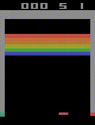

# DQN in Keras + TensorFlow + OpenAI Gym
This is an implementation of DQN (based on [Mnih et al., 2015](http://www.nature.com/nature/journal/v518/n7540/full/nature14236.html)) in Keras + TensorFlow + OpenAI Gym.  

## Requirements
- gym (Atari environment)
- scikit-image
- keras
- tensorflow

## Results
This is the result of training of DQN for about 28 hours (12K episodes, 4.7 millions frames) on AWS EC2 g2.2xlarge instance.  
<br>

<br>
<br>
Statistics of average loss, average max q value, duration, and total reward / episode.  
<br>


## Usage
#### Training
For DQN, run:

```
python dqn.py
```

For Double DQN, run:

```
python ddqn.py
```

#### Visualizing learning with TensorBoard
Run the following:

```
tensorboard --logdir=summary/
```

## Using GPU
I built an AMI for this experiment. All of requirements + CUDA + cuDNN are pre-installed in the AMI.  
The AMI name is `DQN-AMI`, the ID is `ami-c4a969a9`, and the region is N. Virginia. Feel free to use it.  

## ToDo
- [RMSPropGraves](http://arxiv.org/abs/1308.0850)
- [Dueling Network](https://arxiv.org/abs/1511.06581)

## References
- [Mnih et al., 2013, Playing atari with deep reinforcement learning](https://arxiv.org/abs/1312.5602)
- [Mnih et al., 2015, Human-level control through deep reinforcement learning](http://www.nature.com/nature/journal/v518/n7540/full/nature14236.html)
- [van Hasselt et al., 2016, Deep Reinforcement Learning with Double Q-learning](http://arxiv.org/abs/1509.06461)
- [devsisters/DQN-tensorflow](https://github.com/devsisters/DQN-tensorflow)
- [spragunr/deep_q_rl](https://github.com/spragunr/deep_q_rl)
